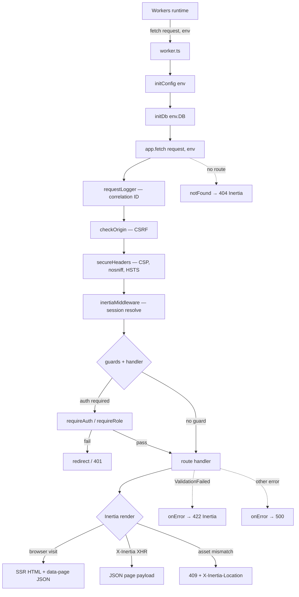

Every request follows the same path. Understanding this chain is the key to
debugging and extending Kilat.

## The chain



## Step by step

### 1. Workers fetch → `worker.ts`

The Workers runtime calls `fetch(request, env)` per request. `env` carries the
D1 + ASSETS bindings and environment variables:

```ts
// src/worker.ts
export default {
  async fetch(request: Request, env: Env): Promise<Response> {
    initConfig(env);       // validate env → module-level config singleton
    initDb(env.DB);        // bind D1 → module-level db singleton
    return app.fetch(request, env);
  },
} satisfies ExportedHandler<Env>;
```

`initConfig` and `initDb` run per-request — cheap pointer assignments to
module-level singletons. Workers isolates are stateless; do not cache state
across requests.

### 2. `requestLogger` — correlation ID

`src/server/logger.ts` assigns a `crypto.randomUUID()` correlation ID to every
request and logs the method + path. This is the first middleware — every
subsequent log line can reference the ID.

### 3. `checkOrigin` — CSRF

`src/server/security.ts` checks the `Origin` header on state-changing requests
(POST, PUT, DELETE, PATCH). If the origin doesn't match `APP_URL`, the request
is rejected. This is the CSRF defense — no token dance, just the Origin check.

### 4. `secureHeaders` — security headers

Hono's `secureHeaders` middleware sets CSP, `X-Content-Type-Options: nosniff`,
`X-Frame-Options: DENY`, referrer policy, permissions policy, and HSTS. The
CSP uses `script-src 'unsafe-inline'` because Inertia embeds the page payload
as inline JSON — external script injection is still blocked.

### 5. `inertiaMiddleware` — session resolve

`src/server/inertia-middleware.ts` reads the session cookie, resolves the
user from D1, and stores the `Inertia` adapter + user on `c.var` (the
`AppEnv` context). Every downstream handler reads `c.var.inertia` and
`c.var.user` — no per-route session plumbing.

### 6. Guards + handler

Guards are Hono middleware that short-circuit the chain by returning a
`Response`, or call `next()` to continue:

- `requireAuth` — redirect to `/login` if no session.
- `guestOnly` — redirect to `/dashboard` if already logged in.
- `requireRole('admin')` — redirect non-admins to `/dashboard`.

```ts
// routes/pages.routes.ts
app.get("/dashboard", requireAuth, async (c) => {
  return c.var.inertia.render("Dashboard", { user: c.var.user });
});
```

Guards MUST call `next()` to continue — returning `undefined` without
`next()` errors with "Context is not finalized".

### 7. Inertia render

The handler calls `c.var.inertia.render(component, props)`. The Inertia
adapter (`src/server/inertia.ts`) decides the response shape:

- **Browser visit** (no `X-Inertia` header): full HTML with SSR markup +
  `data-page` JSON embedded. `renderToString` from `react-dom/server` runs
  inside the Worker bundle.
- **`X-Inertia` XHR**: JSON page payload only — SPA navigation.
- **Asset-version mismatch**: `409 + X-Inertia-Location` — the client reloads.

### 8. `onError` / `notFound`

`app.onError` handles two cases:

- **`ValidationFailed`** (TypeBox) → 422 with field errors, mapped back to the
  Inertia page component that owns the URL.
- **Other errors** → 500 `Internal Server Error`, logged with the correlation
  ID.

`app.notFound` renders the `NotFound` component as a 404 Inertia page.

## Workers-specific notes

- **All DB calls are async.** D1 is async — this cascades to every handler,
  auth function, and middleware.
- **`Response.redirect()` returns immutable headers on Workers.** Hono's
  `secureHeaders` crashes trying to append to a frozen Response. All
  redirects use `new Response(null, { status, headers: { location } })`.
- **No custom compression.** Wrangler/Miniflare auto-compresses with
  gzip/br. A custom compress middleware causes double-compression.
- **Middleware runs in registration order.** Global `app.use()` middleware
  must precede the routes they cover.
- **`c.header()`-queued headers are dropped** when a handler returns a custom
  `Response` — cookie helpers append to `c.res.headers` instead.

## Next steps

- [Conventions](/architecture/conventions/) — the rules that keep handlers consistent.
- [Sessions & guards](/auth/sessions-guards/) — auth middleware in depth.
- [Architecture overview](/architecture/overview/) — the full `src/` layout.
